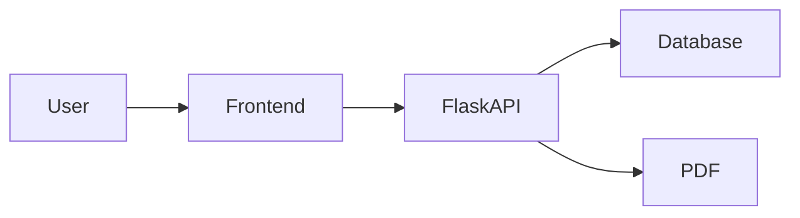
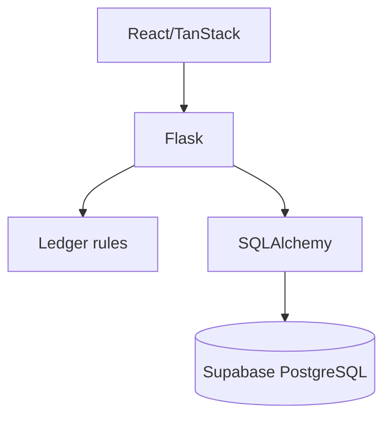
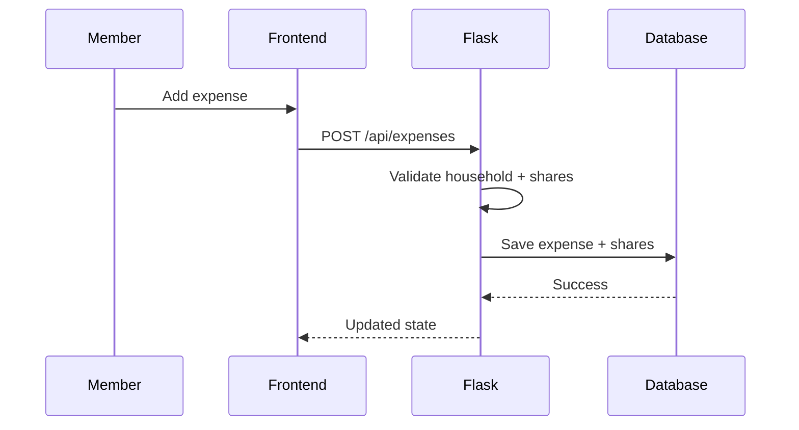
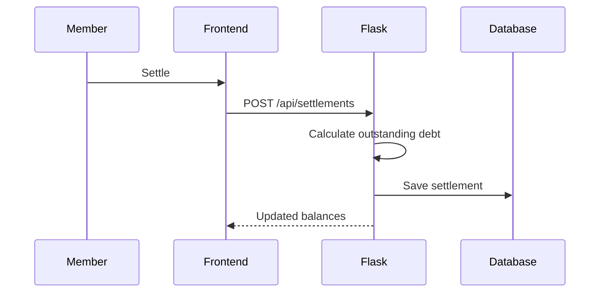
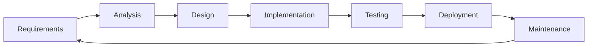

# Mermaid Diagrams

## Context

```mermaid
flowchart LR
  User --> Frontend
  Frontend --> FlaskAPI
  FlaskAPI --> Database
  FlaskAPI --> PDF
```

## Architecture

```mermaid
flowchart TB
  UI[React/TanStack] --> API[Flask]
  API --> Ledger[Ledger rules]
  API --> ORM[SQLAlchemy]
  ORM --> DB[(Supabase PostgreSQL)]
```

## Expense flow

```mermaid
sequenceDiagram
  Member->>Frontend: Add expense
  Frontend->>Flask: POST /api/expenses
  Flask->>Flask: Validate household + shares
  Flask->>Database: Save expense + shares
  Database-->>Flask: Success
  Flask-->>Frontend: Updated state
```

## Settlement flow

```mermaid
sequenceDiagram
  Member->>Frontend: Settle
  Frontend->>Flask: POST /api/settlements
  Flask->>Flask: Calculate outstanding debt
  Flask->>Database: Save settlement
  Flask-->>Frontend: Updated balances
```

## SDLC

```mermaid
flowchart LR
  Requirements --> Analysis --> Design --> Implementation --> Testing --> Deployment --> Maintenance --> Requirements
```
